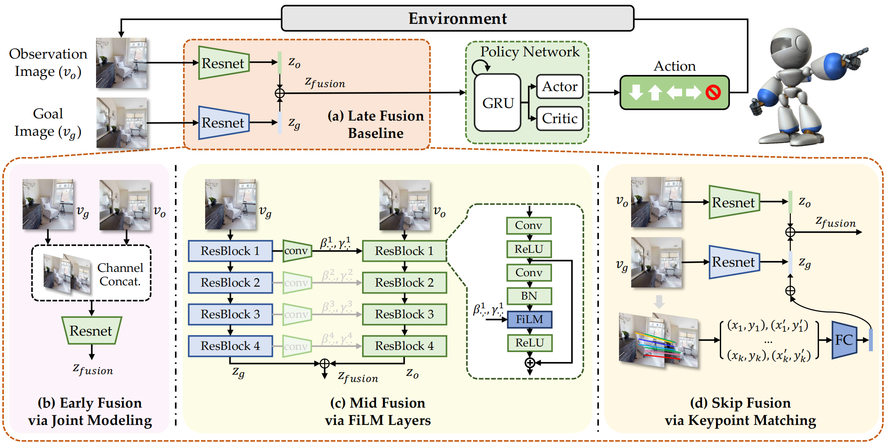

# FGPrompt 🤖
🙌 Official implementation of NeurIPS 2023 accepted paper ["FGPrompt: Fine-grained Goal Prompting for Image-goal Navigation"](https://xinyusun.github.io/fgprompt-pages)

## 0. Overview
We aim to tackle the image-goal navigation task, in which the agent is required to reason the goal location from where a picture is shot. We leverage fine-grained and high-resolution feature maps in the goal image as prompts to perform conditioned embedding, which preserves detailed information in the goal image and guides the observation encoder to pay attention to goal-relevant regions. Compared with existing methods on the image-goal navigation benchmark, our method **brings significant performance improvement** on 3 benchmark datasets (i.e., Gibson, MP3D, and HM3D).



## 1. Install 🚀
### 1.1 Install habitat-lab 🛰️
```bash
# clone habitat-lab code
git submodule init
git submodule update

# create conda env
conda create -n fgprompt python=3.8

# install habitat-sim
conda install habitat-sim=0.2.2 withbullet headless -c conda-forge -c aihabitat

# install pytorch1.11
pip install torch==1.11.0+cu113 torchvision==0.12.0+cu113 -f https://download.pytorch.org/whl/torch_stable.html

# install habitat-lab and habitat-baselines
cd habitat-lab
pip install -e habitat-lab 
pip install -e habitat-baselines
```
### 1.2 Install other requirements 🍔
```bash
pip install requirements.txt
```

We also provide a docker image for reproduce convenience
```bash
docker run -it --name "fgprompt-docker" -v `pwd`:/fgprompt --shm-size=32g --gpus=all csxinyusun/fgprompt:latest /bin/bash
```

## 2. Prepare dataset 🗂️
<!-- 
| ObjectNav   |   Gibson     | train    |  [objectnav_gibson_train](https://utexas.box.com/s/7qtqqkxa37l969qrkwdn0lkwitmyropp)    | `./data/datasets/zer/objectnav/gibson/v1/` |
| ObjectNav   |   Gibson     | val    |  [objectnav_gibson_val](https://utexas.box.com/s/wu28ms025o83ii4mwfljot1soj5dc7qo)    | `./data/datasets/zer/objectnav/gibson/v1/` | -->

### 2.1 Download Datasets 📑
Download the `dataset.zip` file from [tmp.link](https://tmp.link/f/652fd1c43786d) and unarchive it into `data/dataset`

For gibson dataset, we borrow the episodes generated from [`ZER`](https://github.com/ziadalh/zero_experience_required) to train our agent. We then follow the original [imagenav paper](https://github.com/facebookresearch/image-goal-nav-dataset) to test our well-trained agent on the testing episodes. We organize all datasets as follows:

```
data/datasets/
└── imagenav
    ├── gibson
    │   └── v1
    │       ├── train
    │       │   └── content
    │       └── val
    ├── hm3d
    │   └── v1
    │       ├── train
    │       │   └── content
    │       ├── val_easy
    │       │   └── content
    │       ├── val_hard
    │       │   └── content
    │       └── val_medium
    │           └── content
    └── mp3d
        └── v1
            ├── test_easy
            ├── test_hard
            └── test_medium
```

### 2.2 Download Scene Datasets 🕌
Please read the [official guidance](https://github.com/facebookresearch/habitat-sim/blob/main/DATASETS.md#gibson-and-3dscenegraph-datasets) to download `Gibson`, `HM3D`, and `MP3D` scene datasets, and put them in the `data/scene_datasets` directory using lower-case naming. **Feel free to let me know if you having problem downloading these scene files, I will share you a copy on my cloud disk.**
```
data/scene_datasets
├── gibson
├── hm3d
└── mp3d
```

## 3. Run ImageNav Training 🏂
### 3.1 Train a Mid-Fusion Agent 🥽
```bash
MAGNUM_LOG=quiet HABITAT_SIM_LOG=quiet python -m torch.distributed.launch \
--nproc_per_node=4 --master_port=15244 --nnodes=1 \
--node_rank=0 --master_addr=127.0.0.1 \
run.py --overwrite \
--exp-config exp_config/ddppo_imagenav_gibson.yaml,policy,reward,dataset,sensors,mid-fusion \
--run-type train --model-dir results/imagenav/mid-fusion
```

### 3.1 Train a Early-Fusion Agent 👒
```bash
MAGNUM_LOG=quiet HABITAT_SIM_LOG=quiet python -m torch.distributed.launch \
--nproc_per_node=4 --master_port=15244 --nnodes=1 \
--node_rank=0 --master_addr=127.0.0.1 \
run.py --overwrite \
--exp-config exp_config/ddppo_imagenav_gibson.yaml,policy,reward,dataset,sensors,early-fuison \
--run-type train --model-dir results/imagenav/early-fusion
```

## 4. Run Evaluation! 🏆
### 4.1 Download the Trained Model to Reproduce the Results 👯‍♀️
|Name|SR|SPL|
|-|:-:|:-:|
|[Mid-fusion-r9](https://tmp.link/f/652fd40756fad)|90.7%|62.1%|
|[Early-fusion-r9](https://tmp.link/f/6530d3689c6b8)|90.4%|66.5%|
|[Early-fusion-r50](https://tmp.link/f/652fd421b02d9)|94.2%|68.5%|

Eval the midfusion model!

```bash
MAGNUM_LOG=quiet HABITAT_SIM_LOG=quiet python -m torch.distributed.launch \
--nproc_per_node=1 --master_port=15244 --nnodes=1 \
--node_rank=0 --master_addr=127.0.0.1 \
run.py \
--exp-config exp_config/ddppo_imagenav_gibson.yaml,policy,reward,dataset,sensors,mid-fusion,eval \
--run-type eval --model-dir results/imagenav/mid-fusion-r9 \
habitat_baselines.eval_ckpt_path_dir results/imagenav/mid-fusion-9/ckpts/mid-fusion-r9.pth
```

Eval the earlyfusion model!
```bash
# early-fusion-r9
MAGNUM_LOG=quiet HABITAT_SIM_LOG=quiet python -m torch.distributed.launch \
--nproc_per_node=1 --master_port=15244 --nnodes=1 \
--node_rank=0 --master_addr=127.0.0.1 \
run.py \
--exp-config exp_config/ddppo_imagenav_gibson.yaml,policy,reward,dataset,sensors,early-fusion,eval \
--run-type eval --model-dir results/imagenav/early-fusion-r9 \
habitat_baselines.eval_ckpt_path_dir results/imagenav/early-fusion-r9/ckpts/early-fusion-r9.pth

# early-fusion-r50
MAGNUM_LOG=quiet HABITAT_SIM_LOG=quiet python -m torch.distributed.launch \
--nproc_per_node=1 --master_port=15244 --nnodes=1 \
--node_rank=0 --master_addr=127.0.0.1 \
run.py \
--exp-config exp_config/ddppo_imagenav_gibson.yaml,policy,reward,dataset,sensors,early-fusion,eval \
--run-type eval --model-dir results/imagenav/early-fusion-r50 \
habitat_baselines.eval_ckpt_path_dir results/imagenav/early-fusion-r50/ckpts/early-fusion-r50.pth \
habitat_baselines.rl.ppo.backbone resnet50
```

### 4.2 Eval the Model Trained on Your Machine 🕺🏼


## Cite This Paper! 🤗
```
@inproceedings{fgprompt2023,
 author = {Xinyu, Sun and Peihao, Chen and Jugang, Fan and Thomas, H. Li and Jian, Chen and Mingkui, Tan},
 title = {FGPrompt: Fine-grained Goal Prompting for Image-goal Navigation},
 booktitle = {37th Conference on Neural Information Processing Systems (NeurIPS 2023)},
 year = {2023},
} 
```